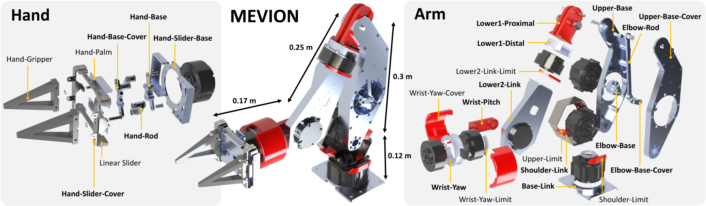

# MEVION

This repository includes the hardware and software components of
"MEVION: Low-Cost Open-Source Data Collection System
for Powerful and High-Speed Dual-Arm Manipulation"

Please refer to the following links for more information.

- [Project Page](https://haraduka.github.io/mevion-hardware/)
- [arXiv](TODO)
- [YouTube](https://youtu.be/huKRzo75_Ww)

## Hardware

You can find all the hardware components in the following link: [Goodle Drive](https://drive.google.com/drive/folders/1d4Cka3J4v5VvGLfFXFn20O5de5R_jduJ?usp=sharing)



## Software

The supported environment is Ubuntu 24.04 with ROS 2 Jazzy. Install
[ROS 2 Jazzy Desktop](https://docs.ros.org/en/jazzy/Installation/Ubuntu-Install-Debs.html)
before following the instructions below.

## Installation on Ubuntu 24.04

A Python virtual environment is used because Ubuntu 24.04 prevents `pip` from
modifying the system Python environment. The `--system-site-packages` option is
required so that the environment can also use ROS packages installed by
`apt` and `rosdep`.

```shell
sudo apt update
sudo apt install python3-colcon-common-extensions python3-rosdep python3-venv

mkdir -p ~/mevion_ws/src
cd ~/mevion_ws
git clone https://github.com/haraduka/mevion.git src/mevion

source /opt/ros/jazzy/setup.bash
sudo rosdep init  # Run this only if rosdep has not been initialized before.
rosdep update
rosdep install --from-paths src --ignore-src --rosdistro jazzy -y

python3 -m venv --system-site-packages .venv
source .venv/bin/activate
python3 -m pip install --upgrade pip
python3 -m pip install -r src/mevion/requirements.txt

colcon build --symlink-install --event-handlers console_direct+
source install/setup.bash
```

Do not use `sudo pip install` or `pip install --break-system-packages`.
Activate the ROS, Python, and workspace environments in each new terminal:

```shell
cd ~/mevion_ws
source /opt/ros/jazzy/setup.bash
source .venv/bin/activate
source install/setup.bash
```

## How to Use

### Setup CAN Devices

```shell
# Find a description such as ATTRS{serial}=="004000325246570C20393733".
udevadm info -a -p /sys/class/net/can0 | grep serial

sudo vim /etc/udev/rules.d/99-usb-can.rules

# Add the following rule, replacing the serial number as necessary.
SUBSYSTEM=="usb", ATTRS{serial}=="004000325246570C20393733", SYMLINK+="can_usb_0"

# Unplug and reconnect the device after reloading the rules.
sudo udevadm control --reload-rules
sudo udevadm trigger
```

### Motor Test

```shell
ros2 run mevion can_setup.sh

# Sense motors.
python3 -m mevion.xiaomimotor_test -i 127 -t sense

# Move motors.
python3 -m mevion.xiaomimotor_test -i 127 -t torque -v 1.0

# Change a motor ID.
python3 -m mevion.xiaomimotor_test -i 127 -t change -n 126

# Bilateral control.
python3 -m mevion.xiaomimotor_test -i 126 127 -t bilateral
```

### robot_utils Test

```shell
python3 -m mevion.robot_utils
```

### Simulation

Make sure that the virtual environment and workspace are sourced as shown
above. Start the interactive console:

```shell
ros2 run mevion ipython
```

Then run the following commands in IPython. `mode` can be `single`, `dual`,
or `quad`. Two windows are opened: the scikit-robot viewer and MuJoCo viewer.

```python
m = Mevion(mode="quad")
m.setup_sim()
m.robot_model.reset_manip_pose()
m.send_angle_vector(
    m.robot_model.arms.angle_vector(),
    3.0,
    interpolation="minjerk",
    comp_torque=True,
    limb="arms",
)
```

RViz can be launched in another sourced terminal. The `robot` argument accepts
`single_mevion`, `dual_mevion`, or `quad_mevion`.

```shell
ros2 launch mevion display_launch.py robot:=quad_mevion
```

### Real Robot

```shell
ros2 run mevion ipython
```

```python
m = Mevion(mode="quad")
m.setup_real()
m.robot_model.reset_manip_pose()
m.send_angle_vector(
    m.robot_model.arms.angle_vector(),
    3.0,
    interpolation="minjerk",
    comp_torque=True,
    limb="arms",
)
```

```shell
ros2 launch mevion display_launch.py robot:=quad_mevion
```

# Tips

## Scikit-robot Viewer Tips
- i: show axis
- w: wireframe
- o: change scale
- a: auto rotation
- s: save image
- q: quit
- f: full screen
- h: show shadow
- l: change light
- n/m: show normals


## How to Make Models
- make detailed models in solidworks and export as 3dxml
- convert 3dxml to dae using convert-urdf-mesh with --force-zero-origin option
- make simple models in solidworks and export as 3dxml
- convert 3dxml to dae using convert-urdf-mesh with --force-zero-origin option
- make simple models in solidworks and export as stl
- use converted detailed model for URDF, and use simple models for STL and DAE files
- please make mevion_dae.urdf and mevion_stl.urdf (just each file path is different)
- use mevion_dae.urdf for rviz and scikit-robot, and use mevion_stl.urdf for mujoco
- cp mevion_stl.urdf to meshes/mevion_mujoco.urdf, compile urdf into xml, change a little (stl path and geom name) and load from scene.xml

# Citation
```
@article{kawaharazuka2026mevion,
  title={{MEVION: Low-Cost Open-Source Data Collection System for Powerful and High-Speed Dual-Arm Manipulation}},
  author={Kento Kawaharazuka and Yoshiki Obinata and Hirokazu Ishida and Jihoon Oh and Temma Suzuki and Shintaro Inoue and Keita Yoneda and Ayumu Iwata and Kei Okada},
  journal={IEEE Robotics and Automation Practice},
  year={2026},
}
```
